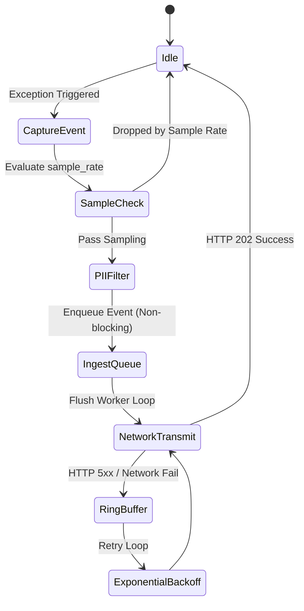

# Sentinel Client SDK Specification & Protocol Guide

**Version**: `1.0.0`  
**Status**: Active Standard  
**Target Audience**: SDK Authors, Open Source Contributors, Architecture Reviewers  
**Source Contract**: [`packages/proto/error_event.proto`](file:///home/fitrapujo/oss/sentinel/packages/proto/error_event.proto)

---

## 1. Overview & Core Philosophy

Sentinel SDKs are lightweight client libraries that capture runtime errors, unhandled exceptions, and diagnostic context from application code and stream them to `ingestor-go`.

### Core Engineering Principles

1. **Zero Impact on Application Performance**: Error capture operations MUST execute asynchronously off the main application looper/thread. An error in Sentinel SDK networking or buffer logic MUST NEVER crash the parent application.
2. **Strict Contract Compliance**: Every SDK MUST serialize events into the exact JSON schema defined by `packages/proto/error_event.proto`.
3. **Client-Side PII Protection**: Sensitive data (tokens, passwords, API keys) MUST be sanitized on the client side before leaving the host environment.
4. **Resilience & Eventual Consistency**: SDKs MUST handle network partition gracefully using bounded in-memory ring buffers and exponential backoff retries.

---

## 2. Configuration Standard

Every Sentinel SDK MUST accept a configuration object or builder pattern with the following standard parameters:

| Parameter | Type | Required | Default | Description |
|:---|:---|:---|:---|:---|
| `api_key` | `string` | **Yes** | — | The SECRET credential (`sent_live_...` or `sent_org_...`). Sent as the `X-API-Key` header ONLY — never in the body. In the Go SDK this is `Config.APIKey`. |
| `project_key` | `string` | Conditional | — | Target project's **unique name** (`projects.name`) — an identifier, NOT a secret. Optional for a project-scoped key (the credential already fixes the project; a mismatch is rejected with 403). **Required** for an organization-wide key, unless supplied as the `X-Project-Key` header, which takes precedence. |
| `endpoint` | `string` | **Yes** | — | Ingestor URL (e.g., `https://sentinel.internal/ingest`). |
| `environment` | `string` | **Yes** | `"production"` | Lowercase alphanumeric environment tag (`production`, `staging`, `development`). |
| `release_version` | `string` | No | `""` | Application version tag (`v1.2.0`) used for automated regression detection. |
| `platform` | `string` | **Yes** | — | Lowercase platform identifier (`golang`, `javascript`, `python`, `rust`, `java`). |
| `sample_rate` | `float` | No | `1.0` | Event sampling ratio (`0.0` to `1.0`). |
| `max_buffer_size` | `int` | No | `100` | Maximum number of events buffered during network outages. |
| `max_breadcrumbs` | `int` | No | `50` | Maximum diagnostic breadcrumbs retained in memory. |
| `debug` | `bool` | No | `false` | Enable SDK internal diagnostic logging to stdout. |

---

## 3. Data Contract & Payload Specification

SDKs MUST construct a JSON HTTP POST body matching `sentinel.v1.ErrorEvent`:

```json
{
  "project_key": "proj_abc123",
  "platform": "golang",
  "environment": "production",
  "release_version": "v1.4.2",
  "error_class": "NilPointerReference",
  "message": "runtime error: invalid memory address",
  "trace_id": "4bf92f3577b34da6a3ce929d0e0e4736",
  "span_id": "00f067aa0ba902b7",
  "timestamp": "2026-07-25T14:00:00Z",
  "stacktrace": [
    {
      "file": "service/user.go",
      "line": 42,
      "function": "GetUserProfile",
      "in_app": true
    }
  ],
  "metadata": {
    "http_method": "GET",
    "http_url": "/api/users/99",
    "user_id": "usr_7712"
  }
}
```

### Protocol Validation Constraints

- **`project_key`**: 1–64 characters. Resolved against `projects.name` **within the authenticated key's organization only** — a name belonging to another organization is 403, never a cross-tenant write.
- **`platform`**: Matches `^[a-z0-9]+$` (lowercase alphanumeric).
- **`environment`**: Matches `^[a-z0-9]+$` (lowercase alphanumeric).
- **`message`**: Truncated to maximum 10,000 characters.
- **`stacktrace`**: Maximum 100 frames. File paths truncated to 512 characters.
- **`metadata`**: Maximum 64 KB total serialized size.

---

## 4. HTTP Transport & Ingestion Handshake

- **HTTP Method**: `POST`
- **Path**: `/ingest`
- **Headers**:
  - `Content-Type: application/json`
  - `X-API-Key: <api_key>` — the SECRET (`sent_live_...` project-scoped, or `sent_org_...` organization-wide). Never place it in the body.
  - `X-Project-Key: <project_name>` — optional; for organization-wide keys, selects the target project. **Takes precedence over the body's `project_key`**, so the server resolves tenancy without reading the body.
- **Expected Status**: `HTTP 202 Accepted` (`{"status": "accepted"}`)

---

## 5. Security & PII Sanitization Rules

SDKs MUST execute client-side PII scrubbing on `metadata` before HTTP payload transmission.

### Mandatory Masking Keys
Any metadata key matching the following case-insensitive patterns MUST be replaced with `"[FILTERED]"`:
- `password`, `pass`, `passwd`
- `authorization`, `auth`, `token`, `bearer`
- `api_key`, `apikey`, `secret`
- `credit_card`, `card_number`, `cvv`
- `ssn`, `social_security`

---

## 6. Asynchronous Buffer & Retry Mechanism



1. **Queue Architecture**: Enqueue events into a bounded thread-safe ring buffer.
2. **Drop Policy**: If the ring buffer exceeds `max_buffer_size`, drop the oldest events first (FIFO drop).
3. **Retry Strategy**:
   - Retry on HTTP 5xx errors or network socket timeouts.
   - Initial backoff: `1 second`. Exponential multiplier: `2x`. Jitter: `±20%`. Max backoff: `60 seconds`.
   - DO NOT retry on HTTP 4xx (Client Error / Invalid Payload).

---

## 7. Graceful Shutdown & Uncaught Handlers

- **Uncaught Exception Hook**: SDKs MUST hook into platform-native crash handlers (e.g. `process.on('uncaughtException')` in Node.js, `sys.excepthook` in Python, Panic recovery in Go middleware).
- **Flush on Exit**: SDKs MUST expose a blocking `Flush(timeoutMs)` method allowing host applications to drain pending events during graceful shutdown (`SIGTERM`, `SIGINT`).

---

## 8. Directory Placement

New SDK implementations MUST be placed in dedicated subdirectories under `packages/`:

- `packages/sdk-go/` — Official Go SDK
- `packages/sdk-js/` — Official JavaScript/TypeScript SDK
- `packages/sdk-python/` — Official Python SDK
