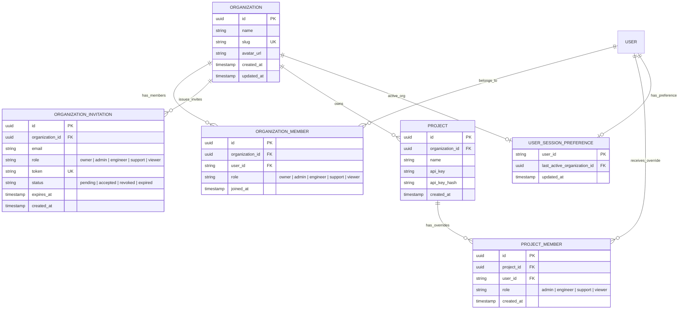

# Phase 1 Data Model: Organization Management Layer

## Entities & Relationships



## Schema Definitions (TypeScript / Drizzle & SQL)

### 1. `organizations` Table
```typescript
export const organizations = pgTable('organizations', {
  id: uuid('id').primaryKey().defaultRandom(),
  name: varchar('name', { length: 255 }).notNull(),
  slug: varchar('slug', { length: 255 }).notNull().unique(),
  avatarUrl: text('avatar_url'),
  createdAt: timestamp('created_at').defaultNow(),
  updatedAt: timestamp('updated_at').defaultNow(),
});
```

### 2. `organization_members` Table
```typescript
export const organizationMembers = pgTable('organization_members', {
  id: uuid('id').primaryKey().defaultRandom(),
  organizationId: uuid('organization_id').notNull().references(() => organizations.id, { onDelete: 'cascade' }),
  userId: varchar('user_id', { length: 255 }).notNull(),
  role: varchar('role', { length: 20 }).notNull().default('viewer'), // owner, admin, engineer, support, viewer
  joinedAt: timestamp('joined_at').defaultNow(),
}, (table) => ({
  uniqueUserOrg: index('org_members_user_org_unique').on(table.userId, table.organizationId),
}));
```

### 3. `organization_invitations` Table
```typescript
export const organizationInvitations = pgTable('organization_invitations', {
  id: uuid('id').primaryKey().defaultRandom(),
  organizationId: uuid('organization_id').notNull().references(() => organizations.id, { onDelete: 'cascade' }),
  email: varchar('email', { length: 255 }).notNull(),
  role: varchar('role', { length: 20 }).notNull().default('viewer'),
  token: varchar('token', { length: 128 }).notNull().unique(),
  status: varchar('status', { length: 20 }).notNull().default('pending'), // pending, accepted, revoked, expired
  expiresAt: timestamp('expires_at').notNull(),
  createdAt: timestamp('created_at').defaultNow(),
});
```

### 4. `user_session_preferences` Table
```typescript
export const userSessionPreferences = pgTable('user_session_preferences', {
  userId: varchar('user_id', { length: 255 }).primaryKey(),
  lastActiveOrganizationId: uuid('last_active_organization_id').references(() => organizations.id, { onDelete: 'set null' }),
  updatedAt: timestamp('updated_at').defaultNow(),
});
```

### 5. Updated `projects` Table
```typescript
// Updated projects schema to include organization_id
export const projects = pgTable('projects', {
  id: uuid('id').primaryKey().defaultRandom(),
  organizationId: uuid('organization_id').notNull().references(() => organizations.id, { onDelete: 'cascade' }),
  name: varchar('name', { length: 255 }).notNull(),
  apiKey: varchar('api_key', { length: 64 }).notNull(),
  apiKeyHash: varchar('api_key_hash', { length: 128 }).notNull(),
  createdAt: timestamp('created_at').defaultNow(),
});
```

## Effective Permission Resolution Logic

```typescript
export function resolveEffectiveProjectRole(
  orgRole: 'owner' | 'admin' | 'engineer' | 'support' | 'viewer',
  projectOverrideRole?: 'admin' | 'engineer' | 'support' | 'viewer' | null
): string {
  // If a project-specific override exists, it takes precedence
  if (projectOverrideRole) {
    return projectOverrideRole;
  }
  // Otherwise inherit organization role
  return orgRole;
}
```
