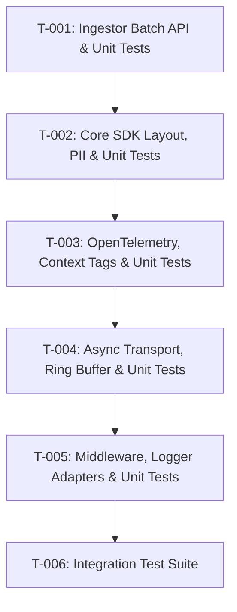

# Tasks: Go Client SDK & Ingestor Batch Protocol

**Feature ID**: `007-go-client-sdk`  
**Feature Branch**: `feature/go-client-sdk`  
**Status**: Task Definition Phase  
**Specification**: [specs/007-go-client-sdk/spec.md](file:///home/fitrapujo/oss/sentinel/specs/007-go-client-sdk/spec.md)  
**Implementation Plan**: [specs/007-go-client-sdk/plan.md](file:///home/fitrapujo/oss/sentinel/specs/007-go-client-sdk/plan.md)  
**Memory Context**: [specs/007-go-client-sdk/memory-synthesis.md](file:///home/fitrapujo/oss/sentinel/specs/007-go-client-sdk/memory-synthesis.md)  
**Security Constraints**: [specs/007-go-client-sdk/security-constraints.md](file:///home/fitrapujo/oss/sentinel/specs/007-go-client-sdk/security-constraints.md)

---

## Task Dependencies & Order

---

## Tasks List

### Phase 1: Ingestor Service Extension
- [x] **T-001**: Implement Batch Ingest API in `apps/ingestor-go` + Dedicated Handler Unit Tests
  - Add `POST /ingest/batch` endpoint in `apps/ingestor-go/main.go`.
  - Parse JSON array `[]ErrorPayload` and validate each event against Protobuf CEL rules (`packages/proto/error_event.proto`).
  - Publish valid events to NATS JetStream subject `error_events` and return `HTTP 202 Accepted` (`{"status": "accepted", "ingested": count}`).
  - **Dedicated Unit Test**: `apps/ingestor-go/service/batch_test.go` verifying valid batches, partial validation errors, and rate-limiting response.

### Phase 2: Core Client SDK & PII Scrubbing
- [x] **T-002**: Initialize `packages/sdk-go` package, PII Scrubber + Dedicated Unit Tests
  - Create `packages/sdk-go/go.mod`, `config.go`, `event.go`, and `pii.go`.
  - Implement stacktrace extractor using Go standard `runtime.Callers`.
  - Implement client-side PII sanitizer replacing metadata keys matching `password`, `authorization`, `secret`, `token`, `credit_card`, `ssn` with `"[FILTERED]"`.
  - **Dedicated Unit Test**: `packages/sdk-go/pii_test.go` verifying sanitization of nested metadata keys and `event_test.go` verifying stacktrace frames.

### Phase 3: Telemetry & Context Wiring
- [x] **T-003**: Implement OpenTelemetry Trace Extraction & Context Tag Helpers + Dedicated Unit Tests
  - Create `packages/sdk-go/context.go`.
  - Implement W3C `trace_id` and `span_id` extraction from `context.Context` OpenTelemetry spans.
  - Implement context helpers: `WithUser(ctx, id)`, `WithTenant(ctx, id)`, `WithTag(ctx, k, v)`, `WithContextMap(ctx, map)`.
  - **Dedicated Unit Test**: `packages/sdk-go/context_test.go` verifying OpenTelemetry trace context extraction and context tag propagation.

### Phase 4: Non-Blocking Channel Transport & Batch Worker
- [x] **T-004**: Implement Ring-Buffer Channel Transport & HTTP Batch Worker + Dedicated Unit Tests
  - Create `packages/sdk-go/transport.go` and `client.go`.
  - Implement non-blocking push to `eventChan chan *Event` with FIFO eviction on buffer overflow (`MaxBufferSize`).
  - Implement background transport worker batching events (up to `BatchSize: 10` or `BatchWait: 1s` timer) sent to `POST /ingest/batch`.
  - Configure `http.Transport` with connection pooling (`MaxIdleConnsPerHost: 100`).
  - Implement `Flush(timeout)` for graceful shutdown.
  - **Dedicated Unit Tests**: `packages/sdk-go/client_test.go` (verifying execution latency < 50 µs and auto-init fallback) and `packages/sdk-go/transport_test.go` (verifying FIFO eviction and batch timer/size flushing).

### Phase 5: Panic Middleware & Logging Adapters
- [x] **T-005**: Implement Panic Middleware & Logger Sub-Packages + Dedicated Unit Tests
  - Create `packages/sdk-go/middleware.go` (`net/http` panic recovery middleware).
  - Create `packages/sdk-go/sentinelslog/handler.go` (`slog.Handler` adapter).
  - Create `packages/sdk-go/sentinelzerolog/hook.go` (`zerolog.Hook` adapter).
  - Create `packages/sdk-go/sentinellog/writer.go` (`io.Writer` adapter).
  - **Dedicated Unit Tests**: `packages/sdk-go/middleware_test.go`, `packages/sdk-go/sentinelslog/handler_test.go`, `packages/sdk-go/sentinelzerolog/hook_test.go`, and `packages/sdk-go/sentinellog/writer_test.go`.

### Phase 6: End-to-End Integration Verification
- [x] **T-006**: Integration Test Suite & Verification
  - Write end-to-end integration test pushing errors from `sdk-go` -> `ingestor-go` -> `NATS` -> `processor-go` -> Postgres.
  - Verify zero latency impact (< 50 µs) on caller thread.
